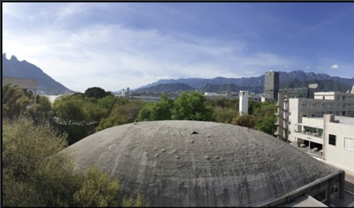
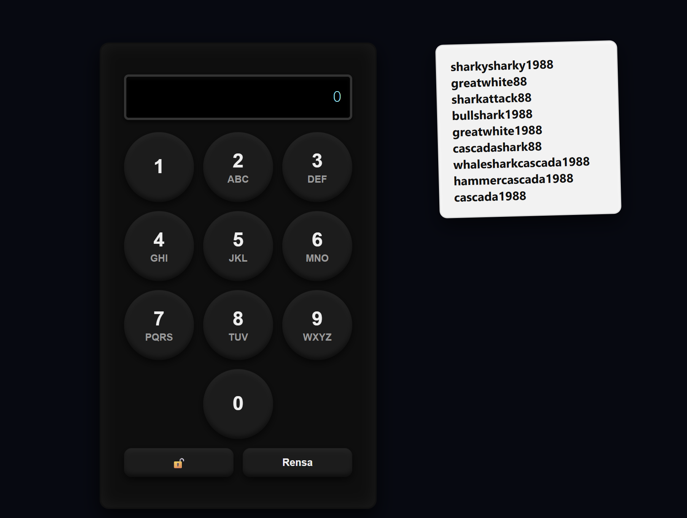
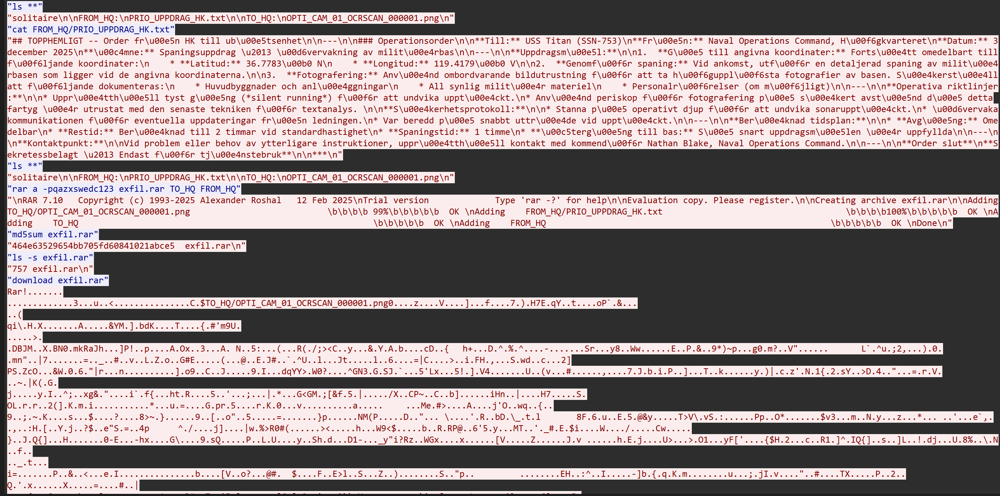

# 🛡️ CTF Dagbok — Undutmaning

> En samling writeups från CTF-tävlingen **Undutmaning** — en Swedish-themed capture the flag där varje utmaning testade en annan aspekt av cybersäkerhet. Här dokumenterar jag mina lösningar, tankesätt och de verktyg som tog mig i mål.

---

## 📋 Innehåll

| # | Utmaning | Kategori | Status |
|---|----------|----------|--------|
| 1 | [Grundare](#-grundare) | OSINT / Metadata | ✅ Löst |
| 2 | [Knappast lätt](#-knappast-lätt) | Kryptografi / Lösenord | ✅ Löst |
| 3 | [Kapten sträng](#-kapten-sträng) | Nätverksanalys / Wireshark | ✅ Löst |

---

## 🔍 Grundare

> **Kategori:** OSINT · Bildanalys · Metadata  
> **Mål:** Hitta namnet på grundaren med hjälp av en bild

### 📸 Utmaningen



### 🧠 Tankesätt & Lösning

Första instinkten var att öppna DevTools och stänga av JavaScript för att se om ett dolt post-it-meddelande dök upp — men DevTools var inaktiverat på sidan, vilket stängde den vägen.

Nästa steg var att testa **ExifTool** i Kali Linux för att leta efter metadata i bilden, men det gav heller inget resultat.

Till slut landade lösningen i en **reverse image search via Google**, kombinerat med att mata in bilden i ChatGPT för att identifiera platsen och kopplade namn. Det gav flaggan.

### 🛠️ Verktyg
- `exiftool` (gav inget resultat)
- Google Reverse Image Search
- ChatGPT bildanalys

---

## 🔐 Knappast lätt

> **Kategori:** Kryptografi · Lösenordsknäckning  
> **Mål:** Knäck PIN-koden via en lösenordslista med hajar och siffror

### 📸 Utmaningen



### 🧠 Tankesätt & Lösning

Utmaningen presenterade en **PIN-dosa** (0–9) där varje siffra hade bokstäver kopplade till sig (precis som ett telefonnummer), tillsammans med en lösenordslista fylld av hajar och årtalet 1988 — t.ex. `greatwhite88`, `bullshark1988`, `cascada1988`.

Första tanken var att söka efter *"Berit beredd"* online för att hitta ledtrådar — det ledde ingenstans.

Lösningen blev att **omvandla bokstäverna i varje lösenord till siffror** baserat på telefonnummermappningen (ABC=2, DEF=3 osv.). ChatGPT fick i uppgift att konvertera hela listan, och sedan testades varje sifferkombination systematiskt tills rätt PIN gav flaggan.

### 🛠️ Verktyg
- Manuell analys av PIN-dosa
- ChatGPT för lösenordskonvertering (text → siffror)

---

## 🚢 Kapten sträng

> **Kategori:** Nätverksanalys · Wireshark · Filextrahering · Metadata  
> **Mål:** Analysera nätverkstrafik och hitta en dold flagga

### 📸 Utmaningen



### 🧠 Tankesätt & Lösning

Den nedladdade filen öppnades automatiskt i **Wireshark**, där tre rader var rödmarkerade. Via *"Följ TCP-stream"* framkom en konversation mellan två båtar — däribland **USS Titan (SSN-753)**.

I konversationen hittades ett lösenord (`pqazxswedc123`) och en fil som laddades ner. Utmaningen låg sedan i att extrahera denna fil ur pcap-datan.

Lösningen: All data konverterades till **Raw**-format och laddades ner. Sedan kördes:

```bash
unrar x -ppqazxswedc123 exfil.rar
```

Det gav en bild — men den var suddig. Tre olika AI-verktyg och GIMP testades för att förbättra kvaliteten, utan framgång.

Efter ett tips om att *"tänka metadata"* kördes ExifTool på bilden:

```bash
exiftool OPTI_CAM_01_OCRSCAN_000001.png
```

Flaggan låg gömd i metadata-fälten.

### 🛠️ Verktyg
- Wireshark (TCP-stream analys)
- `unrar` med lösenord
- `exiftool` ✅
- GIMP + AI-bildförbättring (utan framgång)

---

## 💡 Lärdomar

- **Metadata är alltid värt att kolla** — `exiftool` borde vara ett av de första stegen vid bildutmaningar
- **Reverse image search** är kraftfullt för OSINT-utmaningar
- **Wireshark + Raw export** är nyckeln till att extrahera filer ur pcap-data
- Att omvandla text till siffror via telefonnummermappning är en klassisk CTF-teknik

---

*Skrivet av en CTF-entusiast som lär sig ett steg i taget. 🐾*
